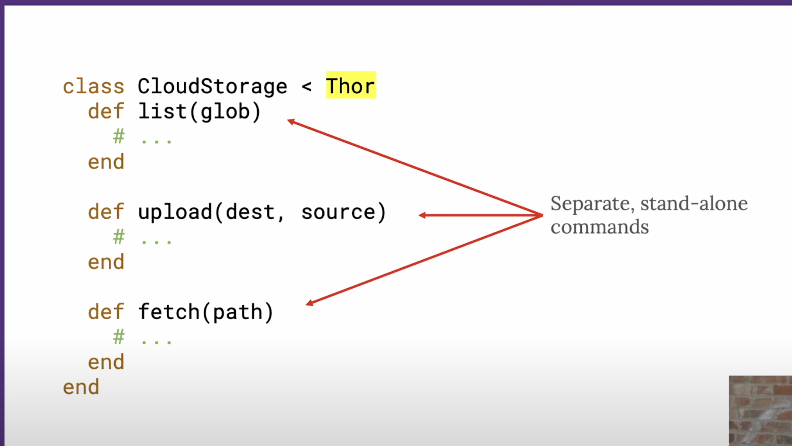
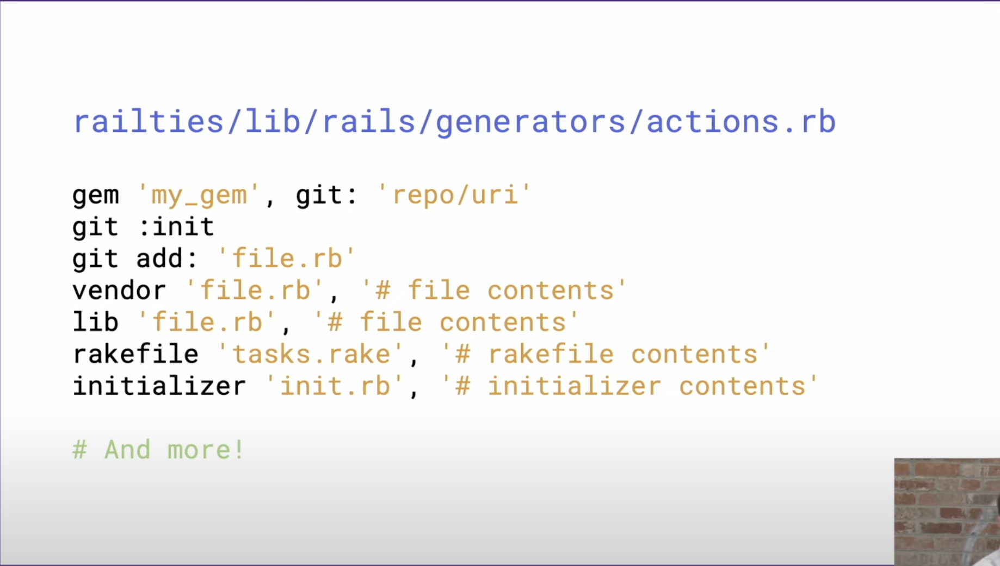

### 


### Jamis Buck - Repurposing the Rails CLI - Rails World 2024
- https://www.youtube.com/watch?v=TtEoWp9XLBc

- mongo no sql has one active record model cause ar only work with sql db

- summary
  - At MongoDB, they wanted to add a tighter integration between Rails and
    Mongoid (their ODM), so they created their our own CLI tool that extends
    the Rails CLI, adding the additional functionality they seeked. Former
    Rails core alumnus and Capistrano-creator Jamis Buck shows how they did it
    at #RailsWorld, and how you can do it yourself.
  
- rails prefer realtionship db

- rails new --database=mongodb app_name 
  - doesnt work. rails hardcode list of supported db

  

  
  
## Thor

### Seperate commands

#### Thor subclass  




  ```ruby
    class CloudStorage < Thor
      def list(glob)
        #... 
      end
      def upload(dest, source)
        #... 
      end
      def fetch(path)
        #...
      end
    end
  ```
- Separate, stand-alone commands, eg:
    - implemented as Thor subclasses


### Complicated commands

#### Thor::Group subclass


eg.


### Modify rails new


just a ruby file that get instance evaled within the context of applicaiton generator. e.g. any code in that file has access to the same DSL that the generator itself uses.

#### example mongodb.rb for generating mongoid


#### Other DSL methods that is avalible




